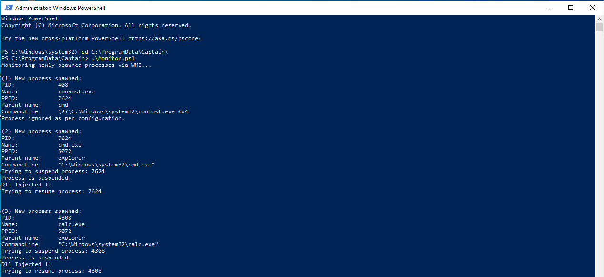

# Captain


[](http://opensource.org/licenses/MIT)


## Overview

Captain is an endpoint monitoring tool that aims at spotting malicious events through API hooking, improving the process of threat hunting analysis .
When a new process is created, Captain will inject a dll into it hooking some Windows API functions.

## Captain signatures

Captain signatures rely on the YAML format to identify malicious events.
With a given set of events generated from the monitor, we can apply a signature to identify malicious behaviours, such as DLL injections, malicious macro executions, Lsass memory dumps, etc.

A Captain signature represents the API call sequence of a given process along with the passed arguments.

For example, to look for some LOLBINS abuse :
```yml
---

- name : mshta malware
  proc_name : mshta.exe
  functions :
    - func_name : CreateProcessW
      arguments :
        lpApplicationName : C:\Windows\system32\cmd.exe
```
Or to spot Dll injection attempts :

```yml
---

- name : DLL Injection
  proc_name : 
  functions :
    - func_name : OpenProcess
    - func_name : VirtualAllocEx
    - func_name : WriteProcessMemory
    - func_name : CreateRemoteThread


```
To spot malicious macro executions :

```yml
---

- name : MS Word macro execution
  proc_name : WINWORD.EXE
  functions :
    - func_name : CreateProcessW
      arguments :
        lpApplicationName : C:\Windows\system32\cmd.exe
        
```

## Detection capabilities
Captain is cable of detecting :

-   Code injection
-   Memory dump
-   Fileless malware
-   Macro execution
-   wmic and mshta malwares
-   etc

Captain supports sysmon output mode. Using the appropriate script, Captain events could be converted into a sysmon-like output.

In addition, Captain signatures could also be used to represent IOC, and thus assisting YARA rules.  

Captain supports different modes:

-   Memory injection mode (To spot memory injection)
-   Malicious behaviour mode
-   IOC mode (Consume resources)

## Usage

To start with, here are Captain components :

-  **Monitor.ps1**: A PowerShell script responsible for monitoring process creations, for each created process, Monitor.ps1 will inject Captain.dll into the process memory using Injector.exe
- **Injector.exe**: A simple program used to inject Captain.dll into processes.
- **Captain.dll**: The dll responsible for hooking Windows API functions and logging events to a JSON file.
- **behan.py**: The behaviour analysing script, written in python, behan.py is used to apply a given signature to a set of events generated by Captain.dll. it will try to explore the events looking for a match of the provided signature.
- **sysconv.py**: A python script to convert Captain events from JSON to an XML, in order to be processed in the same way as sysmon events.

For now, there is no installation script, but to use Captain, first, you should create a folder in **C:\ProgramData\Captain**, which contain **Captain.dll**,  **Monitor.ps1** and **Injector.exe**, then you should start **Montor.ps1** powershell as an Administrator.



Captain will create a subfolder **C:\ProgramData\Captain\Reporting** and store events in JSON format.

```JSON
{"event_time":"2/1/2020 15:44:26:142","function":{"func_name":"OpenProcess"},"proc_id":"3568","proc_name":"C:\\Users\\peter\\Documents\\Captain\\Poc.exe"}
{"event_time":"2/1/2020 15:44:26:142","function":{"func_name":"VirtualAlloc"},"proc_id":"3568","proc_name":"C:\\Users\\peter\\Documents\\Captain\\Poc.exe"}
{"event_time":"2/1/2020 15:44:26:142","function":{"func_name":"WriteProcessMemory"},"proc_id":"3568","proc_name":"C:\\Users\\peter\\Documents\\Captain\\Poc.exe"}
{"event_time":"2/1/2020 15:44:26:142","function":{"func_name":"CreateRemoteThread"},"proc_id":"3568","proc_name":"C:\\Users\\peter\\Documents\\Captain\\Poc.exe"}
{"event_time":"2/1/2020 16:9:33:189","function":{"func_name":"OpenProcess"},"proc_id":"4656","proc_name":"C:\\Program Files\\Sublime Text 3\\sublime_text.exe"}
{"event_time":"2/2/2020 22:27:4:135","function":{"arguments":{"lpLibFileName":"kernel32"},"func_name":"LoadLibraryW"},"proc_id":"7624","proc_name":"C:\\Windows\\system32\\cmd.exe"}
{"event_time":"2/2/2020 22:27:18:321","function":{"arguments":{"lpLibFileName":"kernel32"},"func_name":"LoadLibraryW"},"proc_id":"4308","proc_name":"C:\\Windows\\system32\\calc.exe"}

```

Next, behan.py could be used to hunt for specific behaviour :


```
shell $  python behan.py -h
Usage: behan.py [options] 

Options:
  -h, --help            show this help message and exit
  -s SIG_FILE, --signature=SIG_FILE
                        Specify a signature file to apply
  -S SIG_DIR, --signatures=SIG_DIR
                        Specify a directory of signatures to apply
  -e EV_FILE, --event=EV_FILE
                        Specify an event file to analyze
  -E EV_DIR, --events=EV_DIR
                        Specify a directory of events to analyze

```
```
shell $ python behan.py -S signatures/ -e events.json

[+] Malicious event spotted 

Event :  mshta malware
Event time :  10/6/2019 15:47:37:533
Processus name :  C:\Windows\system32\mshta.exe
Processus ID :  5536
Event function name :  CreateProcessW
	 lpApplicationName  :  C:\Windows\system32\cmd.exe
	 lpCommandLine  :  "C:\Windows\system32\cmd.exe" /q /c chcp 437 & (net session || echo unelevated) 1> C:\Users\peter\AppData\Local\Temp\7c5ff6cb-f678-23e0-59aa-608f777fb707.txt 2>&1


[+] Malicious event spotted 

Event :  regsvr32 malware
Event time :  10/7/2019 20:58:0:219
Processus name :  C:\Windows\System32\regsvr32.exe
Processus ID :  2476
Event function name :  LoadLibraryW
	 lpLibFileName  :  scrobj.dll

```

## Disclaimer
**Please note that this is an alpha version of Captain which is
still undergoing final testing before its official release.  
Please do not use it in a production environment.**

## To do :

* Use Kernel level monitoring for process creation
* Inject DLL from the Kernel using APC
* Protect Captain files using a Kernel Module
...
